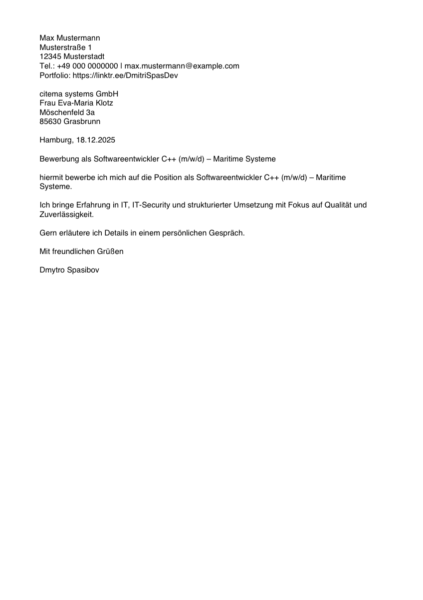

# pdf-docx-generator (Python)


<p align="center">
  <a href="assets/demo.png">
    
  </a>
</p>

## What it does

Generate **PDF & DOCX** documents from structured **JSON** using **Jinja2** templates.

**Use cases:**
- Job application letters (Anschreiben)
- Contracts / repetitive documents
- Any JSON → templated documents

## One-liner example (copy-paste)

```bash
PYTHONPATH=src python src/docgen/cli.py --data examples/anschreiben.sample.json --template templates/anschreiben_de.j2 --outdir output --name demo```

## Project structure

src/docgen/     # generator (core logic + CLI)
templates/      # Jinja2 templates
examples/       # sample JSON data (no personal data)
assets/         # screenshots for README
output/         # generated locally (gitignored)
